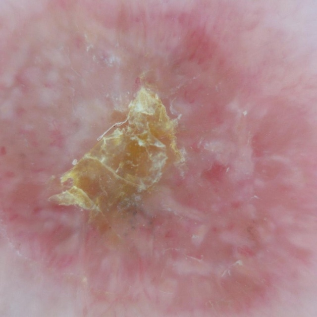
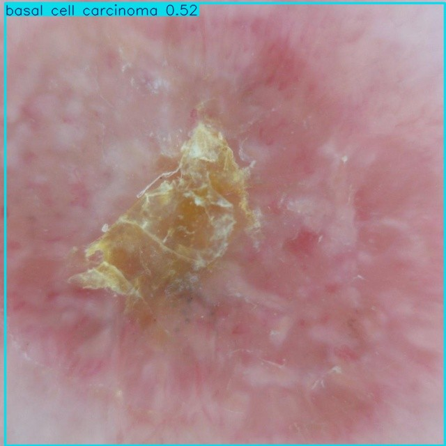

# 🌷 Skin Cancer Detection

A simple Streamlit app to detect skin cancer.

[

### How to try the skin cancer detection app

1. Klik the button "Open the app" or copy this url on your browser https://skin-cancer-detection-with-yolo.streamlit.app/. If the app "sleeping", klik "waking up"

2. Upload your skin lesion picture.
example:

3. Klik "predict" and it will show the result like this

